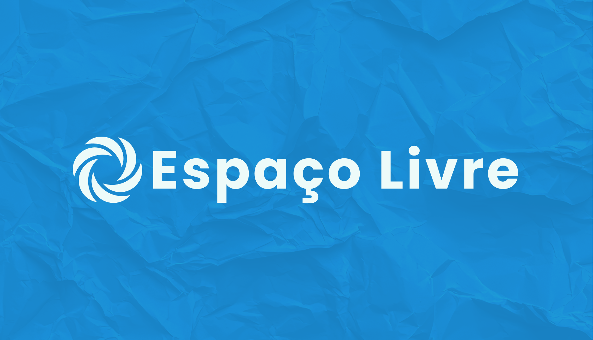

  
  
  
  
  

  
  
  

  

### 📖 Sobre

**Espaço Livre** é uma plataforma dedicada à locação inteligente de ambientes para pessoas e empresas que buscam praticidade, flexibilidade e conectividade. Criada para atender desde pequenos empreendedores até grandes organizações, a plataforma permite encontrar, reservar e administrar espaços com facilidade — seja para eventos, reuniões, coworkings ou iniciativas criativas. Com um sistema intuitivo e foco na experiência do usuário, o **Espaço Livre** conecta donos de espaços a quem precisa deles, promovendo o uso consciente e colaborativo de ambientes urbanos.

#### ⚙️ Funcionalidades

- **Cadastro de Usuário:** Crie sua conta para começar a anunciar ou reservar espaços com praticidade.

- **Login de Usuário:** Acesse sua conta para gerenciar reservas, anúncios e acompanhar suas atividades.

- **Busca de Espaços:** Encontre espaços disponíveis por categoria, localização e data desejada.

- **Anúncio de Espaços:** Cadastre seu espaço para locação e alcance pessoas e empresas interessadas.

- **Sistema de Reservas:** Reserve espaços com agilidade e visualize sua agenda diretamente pela plataforma.

- **Avaliações e Comentários:** Compartilhe experiências e veja a opinião de outros usuários sobre os espaços.

#### 🧰 Tecnologias Utilizadas

- **Next.js:** Framework React com foco em performance, SEO e renderização híbrida (SSR e SSG).

- **TypeScript:** Superset do JavaScript que adiciona tipagem estática, aumentando a segurança e escalabilidade do código.

- **Express.js:** Framework minimalista para Node.js usado no backend da aplicação.

- **PostgreSQL:** Banco de dados relacional robusto, ideal para lidar com múltiplos usuários e reservas.

- **Tailwind CSS:** Framework utilitário para criação rápida e responsiva de interfaces personalizadas.

- **Shadcn/ui:** Conjunto de componentes modernos e acessíveis para construção de interfaces com React.

- **Axios\*:** Cliente HTTP usado para comunicação entre frontend e backend, inclusive com suporte a streaming.

- **Lucida.js** Biblioteca JavaScript para criação de gráficos interativos e ícones

#### 🧰 Testes

- **Jest.js:** Framework de testes em JavaScript para testes unitários e de integração.

- **Cucumber:** Ferramenta de testes BDD (Behavior Driven Development), permitindo escrever testes em linguagem natural.

#### 🖥 Endpoints da API

A aplicação possui uma API RESTful para gerenciar usuários, espaços e reservas. Abaixo alguns dos principais endpoints:

##### 🔐 Autenticação

- `POST /login/`: Realiza o login do usuário.
- `POST /cadastro/clinte`: Cadastra um novo cliente.
- `POST /cadastro/locatario`: Cadastra um novo locatário.

##### 🧑‍💼 Locatários

- `GET /locatarios/`: Lista todos os locatários.
- `POST /locatarios/`: Cadastra um novo locatário (anunciante de espaço).
- `GET /locatarios/:id`: Recupera dados de um locatário específico.
- `PUT /locatarios/:id`: Atualiza os dados do locatário.
- `DELETE /locatarios/:id`: Remove um locatário do sistema.

##### 👥 Clientes

- `GET /clientes/`: Lista todos os clientes.
- `POST /clientes/`: Cadastra um novo cliente.
- `GET /clientes/:id`: Recupera dados de um cliente específico.
- `PUT /clientes/:id`: Atualiza os dados do cliente.
- `DELETE /clientes/:id`: Remove um cliente do sistema.

### 🚀 Como Contribuir

Contribuições são bem-vindas! Para contribuir:

1. Faça um fork do repositório.
2. Crie um novo branch `(git checkout -b feature/NovaFuncionalidade)`.
3. Faça suas alterações.
4. Commit suas alterações `(git commit -m 'Adicionar nova funcionalidade')`.
5. Envie para o branch `(git push origin feature/NovaFuncionalidade)`.
6. Abra um pull request.
